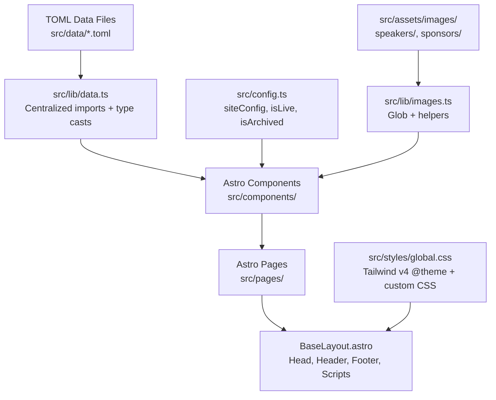

# GopherCon Singapore 2026

The international Go programming language conference for Singapore and Southeast Asia!

## Table of Contents

- [Quick Start](#quick-start)
- [Project Overview](#project-overview)
- [For Content Managers](#for-content-managers)
  - [Update Site Copy](#update-site-copy)
  - [Add a Speaker](#add-a-speaker)
  - [Add a Schedule Entry](#add-a-schedule-entry)
  - [Add a Workshop](#add-a-workshop)
  - [Add a Sponsor](#add-a-sponsor)
  - [Change Event Status](#change-event-status)
- [For Developers](#for-developers)
  - [Project Structure](#project-structure)
  - [Key Architecture Decisions](#key-architecture-decisions)
  - [Adding a New Page](#adding-a-new-page)
  - [Working with Images](#working-with-images)
  - [Styling](#styling)
- [Available Scripts](#available-scripts)
- [Licences](#licences)

## Quick Start

```bash
npm install
npm run dev
```

The site runs at `http://localhost:4321`. Changes to TOML data files and Astro components hot-reload automatically.

## Project Overview

Built with [Astro](https://astro.build/) 5 and [Tailwind CSS](https://tailwindcss.com/) v4. Conference data lives in TOML files under `src/data/` — you edit those to update speakers, schedule, workshops, and sponsors. No CMS required.

```
src/
├── assets/images/       # Speaker photos + sponsor logos (optimized at build)
│   ├── speakers/
│   └── sponsors/
├── components/          # Shared Astro components
│   └── index/           # Home-page-only components
├── data/                # TOML data files (edit these to update content)
│   ├── content.toml     # Hero text, tickets, CoC, footer, sponsor CTA
│   ├── speakers.toml    # Speaker profiles
│   ├── schedule.toml    # Conference day schedule
│   ├── workshops.toml   # Workshop details
│   └── sponsors.toml    # Sponsor tiers and logos
├── layouts/
│   └── BaseLayout.astro # Shared HTML shell (head, header, footer)
├── lib/
│   ├── data.ts          # Centralized TOML loading (don't import TOML elsewhere)
│   └── images.ts        # Speaker image helpers
├── pages/               # Routes: /, /speakers, /schedule, /workshops, /404
├── styles/
│   └── global.css       # Tailwind v4 theme + custom CSS
├── config.ts            # Site config: URL, nav, eventStatus
├── env.d.ts             # TypeScript declarations
└── types.ts             # Data shape interfaces
public/
├── img/                 # Hero images, wave backgrounds, mascot, patterns
└── (favicons)
```

## For Content Managers

All conference content lives in TOML files under `src/data/`. You can edit these with any text editor. Multiline text uses triple quotes (`"""`). Markdown formatting (links, bold, lists) works inside triple-quoted fields.

After editing, run `npm run build` to verify everything compiles correctly.

### Update Site Copy

Edit `src/data/content.toml`. This file contains hero text, ticket info, code of conduct, footer details, and the sponsor CTA. No code changes needed — just edit the text values.

Example — update the conference date:

```toml
[hero]
conferenceDate = "22&ndash;24 January 2026"
```

### Add a Speaker

1. Add the speaker's photo to `src/assets/images/speakers/` (JPG, JPEG, WebP, or PNG)
2. Add an entry to `src/data/speakers.toml`:

```toml
[[speakers]]
id = "jane-doe"
name = "Jane Doe"
company = "Acme Corp"
image = "jane-doe.jpg"
topicTitle = "Building Resilient Go Services"
topicLink = "/schedule#jane-doe"
keynote = false
socialUrl = "https://twitter.com/janedoe"
description = """Jane is a senior engineer at Acme Corp specializing in distributed systems."""
```

The `image` filename must match a file in `src/assets/images/speakers/`. A mismatch crashes the build.

The `id` field becomes the URL anchor (`/speakers#jane-doe`), so use lowercase kebab-case.

### Add a Schedule Entry

Add an entry to `src/data/schedule.toml`:

```toml
[[schedule]]
id = "jane-doe"
title = "Building Resilient Go Services"
time = "2:00 PM"
type = "talk"
recordingUrl = ""
description = """Talk description with **markdown** support."""

[[schedule.speakers]]
name = "Jane Doe"
link = "/speakers#jane-doe"
image = "jane-doe.jpg"
```

The `type` field must be one of: `talk`, `break`, or `meta`. The `speakers` field is always an array — use `[[schedule.speakers]]` even for a single speaker.

### Add a Workshop

1. Add the instructor's photo to `src/assets/images/speakers/` (if not already there from the speakers list)
2. Add an entry to `src/data/workshops.toml`:

```toml
[[workshops]]
id = "intro-to-go"
title = "Introduction to Go"
speaker = "Jane Doe"
speakerLink = "/speakers#jane-doe"
speakerImage = "jane-doe.jpg"
date = "22 January 2026"
time = "9:30am to 5:30pm"
venueRegistration = "registration starts at 9:00am"
venueMapUrl = ""
additional = ""
speakerBio = """Instructor bio text..."""
description = """Workshop description with **markdown** support..."""
prerequisites = """
- Complete the [Go Tour](https://go.dev/tour/welcome/1)
- Have a functioning Go environment installed
"""
venue = """
**IMDA Pixel Innovation Hub**
10 Central Exchange Green
Singapore 138649
"""
```

### Add a Sponsor

1. Add the sponsor's logo to `src/assets/images/sponsors/` (PNG, JPG, or WebP — not SVG)
2. Add an entry to `src/data/sponsors.toml` under the appropriate tier:

```toml
[[platinum]]
name = "Acme Corp"
logo = "acme.png"
```

Available tiers: `[[platinum]]`, `[[diversity]]`, `[[gold]]`, `[[workshop]]`. They display in that order on the site regardless of file order.

### Change Event Status

Edit the `eventStatus` field in `src/config.ts`:

```typescript
eventStatus: "upcoming" as EventStatus,
```

Three states:

| Status | Ticket UI | Header CTA | Home Banner |
| --- | --- | --- | --- |
| `"upcoming"` | Hidden | Hidden | None |
| `"live"` | Tito widget visible | "Get Your Tickets" | None |
| `"archived"` | Hidden | "Watch Recordings" | "Thank you!" banner |

Only set `"live"` after the Tito event (`gopherconsg/2026`) has been created on [ti.to](https://ti.to). Setting it before will cause widget errors.

## For Developers

### Project Structure



### Key Architecture Decisions

- **TOML for data, not content collections.** Editors already know TOML from the Hugo-era sites. Files are imported directly via `vite-plugin-toml` and typed with TypeScript interfaces.
- **Two-tier images.** Speaker photos and sponsor logos go in `src/assets/images/` for Astro's build-time optimization. Hero backgrounds and wave layers stay in `public/img/` as plain files for CSS `background-image` usage.
- **Centralized data loading.** All TOML imports happen in `src/lib/data.ts`. Components never import TOML files directly — they use typed exports like `import { speakers } from "@/lib/data"`.
- **No client-side framework.** Two inline `<script>` blocks handle all interactivity (mobile nav toggle, copy-link-to-clipboard). No React, no Vue, no Astro islands.
- **Tailwind v4 CSS-first.** Theme tokens are defined in `@theme {}` inside `src/styles/global.css`. There is no `tailwind.config.js`.

### Adding a New Page

1. Create `src/pages/your-page.astro`
2. Use `BaseLayout` with `title` and `description` props:

```astro
---
import BaseLayout from "@/layouts/BaseLayout.astro";
---

<BaseLayout title="Your Page" description="Description for SEO">
  <section class="container" style="padding: 3rem 0;">
    <h2>Your Page</h2>
    <!-- content -->
  </section>
</BaseLayout>
```

3. Add a nav entry in `src/config.ts` → `siteConfig.nav` array

Pages only provide slot content. Header and Footer are rendered by BaseLayout — never import them directly.

### Working with Images

Speaker and sponsor images use Astro's `<Image />` component, which requires statically analyzable imports. You cannot use dynamic string paths like `` `../assets/${filename}` ``.

Instead, use the centralized helpers:

```typescript
// Speaker images (centralized in src/lib/images.ts)
import { speakerImages, resolveSpeakerImage } from "@/lib/images";
const img = resolveSpeakerImage(speakerImages, "dave-cheney.jpg"); // throws if missing
```

Hero and background images in `public/img/` are referenced directly in CSS or plain `` tags — they do not go through `<Image />`.

### Styling

Tailwind v4 uses CSS-first configuration. All theme tokens live in `src/styles/global.css`:

```css
@import "tailwindcss";

@theme {
  --color-brand-blue: #14c8e0;
  --color-brand-red: #ee4059;
  --color-link-blue: #0f71bb;
  --font-display: "Dangrek", "Inter", "Helvetica Neue", Arial, sans-serif;
  --font-heading: "Merriweather", Georgia, serif;
  --font-body: "Helvetica Neue", Arial, ui-sans-serif, system-ui, sans-serif;
}
```

Custom properties defined in `@theme` auto-generate utility classes (e.g., `--color-brand-blue` → `bg-brand-blue`).

The primary responsive breakpoint is `md:` (768px), used consistently across all components.

## Available Scripts

| Command | Description |
| --- | --- |
| `npm run dev` | Start dev server at `localhost:4321` |
| `npm run build` | Production build (primary verification step) |
| `npm run preview` | Preview production build locally |
| `npm run lint` | Run Biome linter (`biome check .`) |
| `npm run format` | Auto-format with Biome (`biome format --write .`) |

## Licences

Copyright (c) 2026 The GopherCon Singapore Organisers.

GopherCon Singapore is run under the auspices of [CU Society](https://cu.sg) (UEN: T18SS0020F).

The Gopher character is based on the Go mascot designed by [Renee French](https://reneefrench.blogspot.com/) and copyrighted under the [Creative Commons Attribution 3.0](http://creativecommons.org/licenses/by/3.0/us/) licence.
