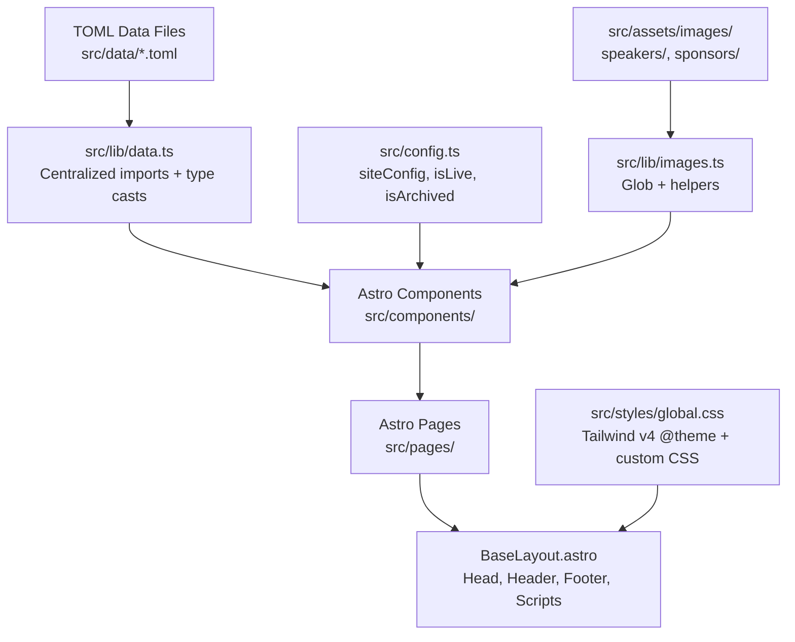

# GopherCon Singapore 2026

The international Go programming language conference for Singapore and Southeast Asia!

## Table of Contents

- [Quick Start](#quick-start)
- [Project Overview](#project-overview)
- [For Content Managers](#for-content-managers)
  - [Update Site Copy](#update-site-copy)
  - [Add a Speaker](#add-a-speaker)
  - [Add a Schedule Entry](#add-a-schedule-entry)
  - [Add a Workshop](#add-a-workshop)
  - [Add a Sponsor](#add-a-sponsor)
  - [Change Event Status](#change-event-status)
- [For Developers](#for-developers)
  - [Project Structure](#project-structure)
  - [Key Architecture Decisions](#key-architecture-decisions)
  - [Adding a New Page](#adding-a-new-page)
  - [Working with Images](#working-with-images)
  - [Styling](#styling)
- [Available Scripts](#available-scripts)
- [Licences](#licences)

## Quick Start

```bash
npm install
npm run dev
```

The site runs at `http://localhost:4321`. Changes to TOML data files and Astro components hot-reload automatically.

## Project Overview

Built with [Astro](https://astro.build/) 5 and [Tailwind CSS](https://tailwindcss.com/) v4. Conference data lives in TOML files under `src/data/` — you edit those to update speakers, schedule, workshops, and sponsors. No CMS required.

```
src/
├── assets/images/       # Speaker photos + sponsor logos (optimized at build)
│   ├── speakers/        # ALL people images: speakers, instructors, team members
│   └── sponsors/
├── components/          # Shared Astro components
│   ├── index/           # Home-page-only components
│   ├── SpeakerNav.astro # Sticky mosaic nav + mobile dropdown for speakers page
│   ├── TimelineLayout.astro # Timeline CSS wrapper for schedule
│   └── WorkshopNav.astro # Sticky dropdown nav for workshops page
├── data/                # TOML data files (edit these to update content)
│   ├── content.toml     # Hero text, tickets, CoC, footer, sponsor CTA
│   ├── speakers.toml    # Speaker display-order index
│   ├── speakers/        # One TOML file per speaker (filename = ID)
│   ├── schedule.toml    # Conference day schedule
│   ├── workshops.toml   # Workshop display-order index
│   ├── workshops/       # One TOML file per workshop (filename = ID)
│   └── sponsors.toml    # Sponsor tiers and logos
├── layouts/
│   ├── BaseLayout.astro # Shared HTML shell (head, header, footer)
│   └── RedirectLayout.astro # Composes BaseLayout with meta-refresh
├── lib/
│   ├── data.ts          # Centralized TOML loading + cross-reference resolution
│   ├── images.ts        # Speaker + sponsor image helpers
│   ├── scroll.ts        # Shared rAF-throttled scroll utility
│   ├── nav-select.ts    # Shared select→scroll navigation
│   └── section-tracker.ts # IntersectionObserver section tracker
├── pages/               # Routes: /, /speakers, /schedule, /workshops, /404
├── styles/
│   └── global.css       # Tailwind v4 theme + base resets
├── config.ts            # Site config: URL, nav, eventStatus
├── env.d.ts             # TypeScript declarations
└── types.ts             # Data shape interfaces
public/
├── img/                 # Hero images, wave backgrounds, mascot, patterns
└── (favicons)
```

## For Content Managers

All conference content lives in TOML files under `src/data/`. You can edit these with any text editor. Multiline text uses triple quotes (`"""`). Markdown formatting (links, bold, lists) works inside triple-quoted fields.

After editing, run `npm run build` to verify everything compiles correctly.

### Update Site Copy

Edit `src/data/content.toml`. This file contains hero text, ticket info, code of conduct, footer details, and the sponsor CTA. No code changes needed — just edit the text values.

Example — update the conference date:

```toml
[hero]
conferenceDate = "22&ndash;24 January 2026"
```

### Add a Speaker

1. Add the speaker's photo to `src/assets/images/speakers/` (JPG, JPEG, WebP, or PNG)
2. Create `src/data/speakers/<speaker-id>.toml` (the filename becomes the ID):

```toml
name = "Jane Doe"
company = "Acme Corp"
image = "jane-doe.jpg"
socialUrl = "https://twitter.com/janedoe"
bio = """Jane is a senior engineer at Acme Corp specializing in distributed systems."""

[[sessions]]
title = "Building Resilient Go Services"
kind = "talk"
```

The `[[sessions]]` block lists what the speaker is presenting. Each session needs a `title` and `kind` (`keynote`, `talk`, `workshop`, `moderator`, or `panelist`). Speakers with multiple sessions get multiple `[[sessions]]` blocks. Links to `/schedule#...` or `/workshops#...` are auto-generated.

#### Speaker Fields

| Field | Required | Description |
|---|---|---|
| `name` | yes | Full legal/professional name |
| `image` | yes | Filename in `src/assets/images/speakers/` — missing file crashes build |
| `bio` | yes | Triple-quoted (`"""`) biography, supports markdown |
| `company` | no | Company or affiliation |
| `socialUrl` | no | Social profile URL (Twitter/X, GitHub, etc.) |
| `url` | no | Personal website URL |
| `preferredName` | no | Display name if different from full name (e.g. "Bill" for "William Kennedy") |
| `[[sessions]]` | no | Repeated block per session. Each needs `title`, `kind` (`keynote`, `talk`, `workshop`, `moderator`, `panelist`), and `description` (triple-quoted, supports markdown). For `talk`/`keynote` sessions, the title and description here are the canonical source — they auto-populate the schedule page. No need to duplicate them in `schedule.toml` |

3. Add the speaker's ID (filename without `.toml`) to the `order` array in `src/data/speakers.toml`:

```toml
order = [
  "existing-speaker",
  "jane-doe",
]
```

Speakers not listed in `order` are appended alphabetically. A missing image file crashes the build.

### Add a Schedule Entry

Add an entry to `src/data/schedule.toml`:

```toml
[[schedule]]
time = "2:00pm"
type = "talk"
speakers = ["jane-doe"]
```

For single-speaker `talk` and `keynote` entries, keep it minimal — only `time`, `type`, and `speakers` are needed. The `id`, `title`, and `description` are auto-resolved from the speaker's `[[sessions]]` block:

- **`id`** defaults to the first speaker ID (e.g. `jane-doe`)
- **`title`** comes from the matching `[[sessions]]` entry (matched by `kind` = entry `type`)
- **`description`** comes from the matching `[[sessions]]` entry

You can override any of these by adding them explicitly. Multi-speaker entries need an explicit `id` if neither speaker ID works as the anchor. For `panel`, `lightning`, `break`, and `meta` entries, add `id`, `title`, and `description` directly.

The `type` field must be one of: `talk`, `keynote`, `panel`, `lightning`, `break`, or `meta`.

The `speakers` field is an array of speaker IDs matching files in `src/data/speakers/`. Times use lowercase am/pm format (e.g., `9:00am`, `12:30pm`).

Entries render in file order — keep them chronological.

Dangling speaker references (IDs that don't match a speaker file) will produce a warning during build.

#### Schedule Entry Fields

| Field | Required | Description |
|---|---|---|
| `type` | yes | One of: `talk`, `keynote`, `panel`, `lightning`, `break`, `meta` |
| `speakers` | no | Array of speaker IDs, e.g. `["jane-doe"]` |
| `time` | no | Lowercase am/pm format, e.g. `9:00am`, `12:30pm`. Omit for untimed entries |
| `id` | no | Anchor ID for URLs (`/schedule#id`). Auto-derived from first speaker ID for `talk`/`keynote` — only needed for overrides or entries without speakers |
| `title` | no | Session title. Auto-resolved from the speaker's `[[sessions]]` block for `talk`/`keynote` — only needed for overrides or entries without speakers |
| `description` | no | Triple-quoted, supports markdown. Auto-resolved from speaker's `[[sessions]]` block for `talk`/`keynote`. Only add for `break`, `meta`, `panel`, `lightning` entries |
| `moderator` | no | Speaker ID for panel moderator |
| `panelists` | no | Array of `{ id = "speaker-id" }` or `{ tba = true, name = "TBA" }` |
| `talks` | no | For `lightning` type: array of `{ title, speaker, duration? }` |
| `recordingUrl` | no | Post-conference recording URL (for `archived` status) |

### Add a Workshop

1. Create `src/data/workshops/<workshop-id>.toml` (the filename becomes the ID):

**For workshops by conference speakers:**

```toml
title = "Introduction to Go"
speakers = ["jane-doe"]
date = "22 January 2026"
time = "9:00am to 5:30pm"
venueMapUrl = ""
note = ""
description = """Workshop description with **markdown** support.

#### Curriculum Section

Content here...
"""
prerequisites = """
- Complete the [Go Tour](https://go.dev/tour/welcome/1)
"""
venue = """
To be confirmed
"""
```

**For workshops by external/community instructors** (not on the speakers page):

```toml
title = "Build Your Own Macropad"
date = "22 January 2026"
time = "9:30am to 5:30pm"
note = "Hardware kit included."
description = """Workshop description..."""
prerequisites = """..."""
venue = """To be confirmed"""

[instructor]
name = "TinyGo Keeb community (Japan)"
url = "https://tinygo-keeb.org/"
image = "tinygokeeb-sago35.png"
socialUrl = "https://x.com/tinygo_keeb"
bio = """Community description..."""

[[teamMembers]]
name = "Member Name"
image = "member-photo.png"
bio = """Short bio..."""
```

2. Add the workshop ID to `src/data/workshops.toml`:

```toml
order = ["existing-workshop", "new-workshop"]
```

All instructor, team member, and speaker images go in `src/assets/images/speakers/` regardless of role.

#### Workshop Fields

| Field | Required | Description |
|---|---|---|
| `title` | yes | Workshop title |
| `date` | yes | Free-text date, e.g. `"22 January 2026"` or `"20 & 21 May 2026"` |
| `time` | yes | Time range, e.g. `"9:00am to 5:30pm"` |
| `venue` | yes | Venue name/address. Use triple-quotes for multi-line |
| `description` | yes | Triple-quoted, supports markdown |
| `speakers` | conditional | Array of speaker IDs — use for conference speakers on the speakers page |
| `[instructor]` | conditional | Inline instructor block — use for external instructors not on the speakers page |
| `prerequisites` | no | Triple-quoted prerequisites, supports markdown |
| `note` | no | Short note shown as an aside (e.g. "Hardware kit included") |
| `venueRegistration` | no | Note shown under venue (e.g. "registration starts at 9:00am") |
| `venueMapUrl` | no | Link to venue map |
| `[[teamMembers]]` | no | Repeated block for team-taught workshops. Each needs `name`, `image`, `bio` |

### Add a Sponsor

1. Add the sponsor's logo to `src/assets/images/sponsors/` (PNG, JPG, or WebP — not SVG)
2. Add an entry to `src/data/sponsors.toml` under the appropriate tier:

```toml
[[platinum]]
name = "Acme Corp"
logo = "acme.png"
```

Available tiers: `[[platinum]]`, `[[diversity]]`, `[[gold]]`, `[[workshop]]`. They display in that order on the site regardless of file order.

#### Sponsor Fields

| Field | Required | Description |
|---|---|---|
| `name` | yes | Sponsor/company name |
| `logo` | yes | Filename in `src/assets/images/sponsors/` |
| `url` | no | Sponsor website URL |

### Change Event Status

Edit the `eventStatus` field in `src/config.ts`:

```typescript
eventStatus: "upcoming" as EventStatus,
```

Three states:

| Status | Ticket UI | Header CTA | Home Banner |
| --- | --- | --- | --- |
| `"upcoming"` | Hidden | Hidden | None |
| `"live"` | Tito widget visible | "Get Your Tickets" | None |
| `"archived"` | Hidden | "Watch Recordings" | "Thank you!" banner |

Only set `"live"` after the Tito event (`gopherconsg/2026`) has been created on [ti.to](https://ti.to). Setting it before will cause widget errors.

## For Developers

### Project Structure



### Key Architecture Decisions

- **TOML for data, not content collections.** Editors already know TOML from the Hugo-era sites. Files are imported directly via `vite-plugin-toml` and typed with TypeScript interfaces.
- **Two-tier images.** Speaker photos and sponsor logos go in `src/assets/images/` for Astro's build-time optimization. Hero backgrounds and wave layers stay in `public/img/` as plain files for CSS `background-image` usage.
- **Centralized data loading.** All TOML imports happen in `src/lib/data.ts`. Components never import TOML files directly — they use typed exports like `import { speakers } from "@/lib/data"`.
- **No client-side framework.** Inline `<script>` blocks handle all interactivity (mobile nav toggle, copy-link, scroll-tracking navigation). Shared utilities in `src/lib/` (`scroll.ts`, `nav-select.ts`, `section-tracker.ts`) eliminate duplication across pages. No React, no Vue, no Astro islands.
- **Tailwind v4 CSS-first.** Theme tokens are defined in `@theme {}` inside `src/styles/global.css`. There is no `tailwind.config.js`.

### Adding a New Page

1. Create `src/pages/your-page.astro`
2. Use `BaseLayout` with `title` and `description` props:

```astro
---
import BaseLayout from "@/layouts/BaseLayout.astro";
---

<BaseLayout title="Your Page" description="Description for SEO">
  <section class="container" style="padding: 3rem 0;">
    <h2>Your Page</h2>
    <!-- content -->
  </section>
</BaseLayout>
```

3. Add a nav entry in `src/config.ts` → `siteConfig.nav` array

Pages only provide slot content. Header and Footer are rendered by BaseLayout — never import them directly.

### Working with Images

Speaker, instructor, and sponsor images use Astro's `<Image />` component, which requires statically analyzable imports. You cannot use dynamic string paths.

Instead, use the centralized helpers in `src/lib/images.ts`:

```typescript
import { speakerImages, resolveSpeakerImage, findSponsorImage } from "@/lib/images";
const img = resolveSpeakerImage(speakerImages, "dave-cheney.jpg"); // throws if missing
const logo = findSponsorImage("acme.png"); // returns null if missing
```

**All people images** (speakers, workshop instructors, team members) go in `src/assets/images/speakers/` and are referenced by bare filename in TOML files.

**Sponsor logos** go in `src/assets/images/sponsors/`.

Hero and background images in `public/img/` are referenced directly in CSS — they do not go through `<Image />`.

### Styling

Tailwind v4 uses CSS-first configuration. All theme tokens live in `src/styles/global.css`:

```css
@import "tailwindcss";

@theme {
  --color-brand-blue: #14c8e0;
  --color-brand-red: #ee4059;
  --color-link-blue: #0f71bb;
  --font-display: "Dangrek", "Inter", "Helvetica Neue", Arial, sans-serif;
  --font-heading: "Merriweather", Georgia, serif;
  --font-body: "Helvetica Neue", Arial, ui-sans-serif, system-ui, sans-serif;
}
```

Custom properties defined in `@theme` auto-generate utility classes (e.g., `--color-brand-blue` → `bg-brand-blue`).

The primary responsive breakpoint is `md:` (768px), used consistently across all components.

## Available Scripts

| Command | Description |
| --- | --- |
| `npm run dev` | Start dev server at `localhost:4321` |
| `npm run build` | Production build (primary verification step) |
| `npm run preview` | Preview production build locally |
| `npm run lint` | Run Biome linter (`biome check .`) |
| `npm run format` | Auto-format with Biome (`biome format --write .`) |

## Licences

Copyright (c) 2026 The GopherCon Singapore Organisers.

GopherCon Singapore is run under the auspices of [CU Society](https://cu.sg) (UEN: T18SS0020F).

The Gopher character is based on the Go mascot designed by [Renee French](https://reneefrench.blogspot.com/) and copyrighted under the [Creative Commons Attribution 3.0](http://creativecommons.org/licenses/by/3.0/us/) licence.
